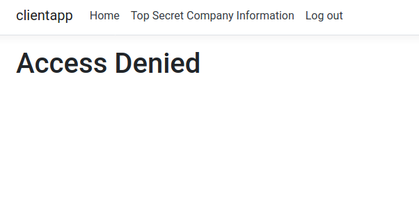

# Readme

## Purpose

The purpose of this project is to make a proof of concept of how to write e2e tests with cypress and gherkin. The main advantage of using gherkin is that feature files can be written by any stakeholder in the project, and can be directly used as input for the e2e tests. The `.feature` files can be found under `cypress/cypress/integration`; and the contents of these feature files are also listed in the [specification document](featurefiles/Specification.md).

## Technologies used

- **Cypress**: e2e tests
- **Gherkin**: feature scenario's
- **Cucumber** translate Gherkin keywords into cypress tests

## Demo application

Suppose this is the portal for a demo company. There are 2 employees: Bob and Alice. Alice is the CEO and has access to the top secret company info on the portal, Bob is just a regular employee and is not allowed to view this page.

| Username | Password |
| -------- | -------- |
| bob      | password |
| alice    | password |




## Project

- ClientApp represents the Portal application
- IdentityServer is used for authentication and authorization
- Cypress contains the e2e tests and feature files.

## Run the project

- Run the clientapp and identityserver by going in their respective folders and running the following command

```
dotnet run
```

- Navigate to the cypress folder and type the following commands

```
npm install
$(npm bin)/cypress open
```


