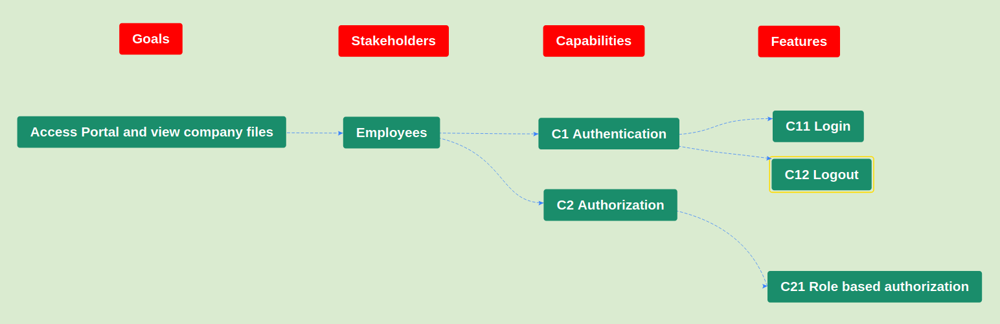

# Specification document

## Introduction

This document is intended for the software developers, business people and stakeholders in the portal web app project. The features required to implement this system will be listed.

## Glossary

| Concept       | Definition                                                                                  |
| ------------- | ------------------------------------------------------------------------------------------- |
| Employee      | Person that will make use of the web app                                                    |
| Administrator | **Employee** that has access to top secret company files                                    |
| User          | **Employee** that can only access the portal, but can't access the top secret company files |

## Scope and capabilities

Secure the portal web app through authentication and authorization. There should be users defined with different roles (e.g. user, admin, ...); their roles determine whether they can access certain resources or not.

Screenshot below shows the impact map of these capabilities.



## Features

### C11 Login

```gherkin
Feature: Login
    After an employee enters his/her username and password, he should be redirected to succes screen or failed screen

    Scenario: Login successfully
        Given employee enters username bob
        And employee enters password password
        And employee presses login button
        Then employee proceeds to home page

    Scenario: Login failed
        Given employee enters username bob
        And employee enters password pass
        And employee presses login button
        Then employee sees login failed error message
```

### C12 Logout

```gherkin
Feature: Logout
    After an employee logged in, he/she can logout again

    Background:
        Given admin is logged in

    Scenario: Logout successfully
        Given employee tries to log out
        Then employee is redirected to the login screen
```

### C21 Role based authorization

```gherkin
Feature: Role based authorization
    Scenario: Admin can view company secrets
        Given admin is logged in
        And employee tries to access the company secrets
        Then employee sees the company secrets page

    Scenario: User cannot view company secrets
        Given user is logged in
        And employee tries to access the company secrets
        Then employee sees the access denied page
```


